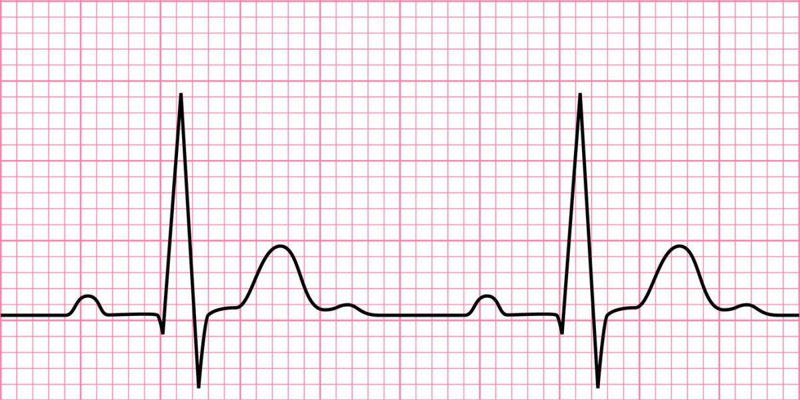

# Data Science Profile
__________

## Deep Learning 

### Automatic Interpretation of 12-Lead ECG for detecting Cardiovascular diseases

Cardiovascular disease is the leading cause of death in India and also around the world. Early diagnosis can prevent serious future events. 12-Lead ECG is gold standard for screening and diagnosing cardiac electrical abnormalities. ECG has proved to be an effective non-invasive tool for detecting both short term and long term risks. However accurate interpretation of ECG is non-trivial, even a challenge for the cardiologiest.  Automatic detection and classification of cadiac disease can assis physicians in early detection, specially in rural India, which lacks trained professionals. 

The solution includes checking the quality of the signals, cleaning using DSP techniques, using CNN based architecture for automatic classification. 

<code cannot be shared / will upload a simple version of code later>

-----------------------
## Machine Learning

### Few Time Series Forcasting Techniques 

It contains examples of few time series forcasting techniques.

